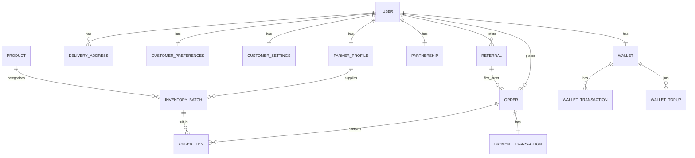

# Database Schema 🗄️

Freshon OS uses PostgreSQL. The schema is optimized for traceability and financial auditing.

## 1. Accounts App

### **Table: `User`**
| Field | Type | Description |
|---|---|---|
| `id` | UUID | Primary Key |
| `username` | String | Unique username |
| `email` | String | User email |
| `role` | Enum | `ADMIN`, `FARMER`, `CUSTOMER`, `DELIVERY` |
| `is_verified` | Boolean | Identity verification status |

### **Table: `FarmerProfile`**
| Field | Type | Description |
|---|---|---|
| `user` | OneToOne | Link to `User` |
| `location` | String | Farm location |
| `rating` | Decimal | Average customer rating |
| `speciality` | String | e.g., "Organic Berries" |
| `years_of_experience` | Integer | Farming history |

### **Table: `UserAddress`**
| Field | Type | Description |
|---|---|---|
| `user` | FK | Link to `User` |
| `name` | String | Address label (e.g., "Home", "Office") |
| `phone` | String | Contact number |
| `line1` | String | Street address |
| `area` | String | Locality/Area |
| `landmark` | String | Nearby landmark |
| `is_default` | Boolean | Primary address flag |
| `created_at` | DateTime | Creation timestamp |

### **Table: `CustomerPreferences`**
| Field | Type | Description |
|---|---|---|
| `user` | OneToOne | Link to `User` |
| `organic_only` | Boolean | Show only organic products |
| `vegetarian` | Boolean | Vegetarian preference |
| `avoid_plastic` | Boolean | Plastic-free packaging preference |
| `allergens` | String | Allergen notes |
| `notes` | Text | Additional preferences |

### **Table: `CustomerSettings`**
| Field | Type | Description |
|---|---|---|
| `user` | OneToOne | Link to `User` |
| `order_updates` | Boolean | SMS/Push for order status |
| `offers` | Boolean | Promotional notifications |
| `weekly_summary` | Boolean | Weekly order digest |
| `private_profile` | Boolean | Hide profile from others |

---

## 2. Inventory App

### **Table: `Product`**
- **Purpose**: Global catalog of items.
- **Fields**: `name`, `unit`, `description`, `storage_instructions`, `category_id`.

### **Table: `InventoryBatch`**
- **Purpose**: Specific stock harvested by a farmer.
- **Fields**: 
    - `farmer_id` (FK)
    - `product_id` (FK)
    - `price` (Current)
    - `mrp`
    - `stock_level` (Live)
    - `harvest_date` (DateTime)
    - `is_organic` (Boolean)

---

## 3. Orders App

### **Table: `Order`**
| Field | Type | Description |
|---|---|---|
| `tracking_id` | String | Unique `FRSH-XXXXXX` |
| `user_id` | FK | Customer who bought it |
| `total` | Decimal | Final price |
| `status` | Enum | `PENDING` -> `DELIVERED` |

### **Table: `OrderItem`**
- **Purpose**: Snapshots each item in an order.
- **Fields**: `order_id`, `batch_id`, `product_name`, `price_at_order`, `quantity`.

---

## 4. Delivery App

### **Table: `DeliverySlot`**
| Field | Type | Description |
|---|---|---|
| `id` | String | Primary Key (e.g., "EXPRESS") |
| `title` | String | Display name |
| `description` | String | Slot description |
| `slot_type` | Enum | EXPRESS, SAME_DAY, NEXT_DAY |
| `delivery_fee` | Decimal | Fee for this slot |
| `available` | Boolean | Active status |

### **Table: `DeliveryAddress`**
| Field | Type | Description |
|---|---|---|
| `user` | FK | Link to `User` |
| `address_type` | Enum | HOME, WORK, OTHER |
| `title` | String | Address label |
| `address_line` | Text | Full address |
| `latitude` | Decimal | GPS latitude |
| `longitude` | Decimal | GPS longitude |
| `is_default` | Boolean | Primary address |

### **Table: `ServiceArea`**
| Field | Type | Description |
|---|---|---|
| `name` | String | Area name (e.g., "Koramangala") |
| `center_latitude` | Decimal | Center point lat |
| `center_longitude` | Decimal | Center point lon |
| `radius_km` | Decimal | Delivery radius |
| `is_active` | Boolean | Active status |

---

## 5. Payment App

### **Table: `PaymentTransaction`**
| Field | Type | Description |
|---|---|---|
| `order` | OneToOne | Link to `Order` |
| `razorpay_order_id` | String | Razorpay order ID |
| `razorpay_payment_id` | String | Payment ID (after completion) |
| `razorpay_signature` | String | Signature for verification |
| `amount` | Decimal | Payment amount |
| `currency` | String | Currency (INR) |
| `status` | Enum | INITIATED, COMPLETED, FAILED, REFUNDED |

---

## 6. Wallet App

### **Table: `Wallet`**
| Field | Type | Description |
|---|---|---|
| `user` | OneToOne | Link to `User` |
| `balance` | Decimal | Current wallet balance |
| `tier` | Enum | STANDARD, PRIDE_1, PRIDE_2, PRIDE_3 |
| `last_monthly_credit_date` | DateTime | Last monthly credit timestamp |
| `last_loyalty_bonus_date` | DateTime | Last annual bonus timestamp |

### **Table: `WalletTransaction`**
| Field | Type | Description |
|---|---|---|
| `wallet` | FK | Link to `Wallet` |
| `amount` | Decimal | Transaction amount |
| `reason` | Enum | TOPUP, ORDER_PAYMENT, ORDER_REFUND, MONTHLY_CREDIT, LOYALTY_BONUS, REFERRAL_BONUS |
| `balance_before` | Decimal | Balance before transaction |
| `balance_after` | Decimal | Balance after transaction |
| `related_order` | FK | Link to `Order` (for refunds) |
| `created_at` | DateTime | Transaction timestamp |

### **Table: `WalletTopup`**
| Field | Type | Description |
|---|---|---|
| `wallet` | FK | Link to `Wallet` |
| `amount` | Decimal | Top-up amount |
| `razorpay_order_id` | String | Razorpay order ID |
| `razorpay_payment_id` | String | Payment ID |
| `status` | Enum | INITIATED, PENDING, SUCCESS, FAILED |

### **Table: `Partnership`**
| Field | Type | Description |
|---|---|---|
| `user` | OneToOne | Link to `User` |
| `tier` | Enum | TIER_1 (₹1.5L), TIER_2 (₹3L), TIER_3 (₹5L) |
| `invested_amount` | Decimal | Investment amount |
| `monthly_credit_percentage` | Decimal | Monthly credit % (default 10%) |
| `annual_loyalty_percentage` | Decimal | Annual bonus % (default 5%) |
| `refund_requested` | Boolean | Refund status |
| `start_date` | DateTime | Partnership start date |

### **Table: `Referral`**
| Field | Type | Description |
|---|---|---|
| `referrer` | FK | User who referred |
| `referee` | FK | Referred user |
| `referral_code` | String | Unique referral code |
| `bonus_amount` | Decimal | Bonus earned |
| `status` | Enum | PENDING, COMPLETED, CREDITED, FAILED |
| `first_order` | FK | First order by referee |
| `bonus_credited_date` | DateTime | When bonus was credited |

---

## Relationships

