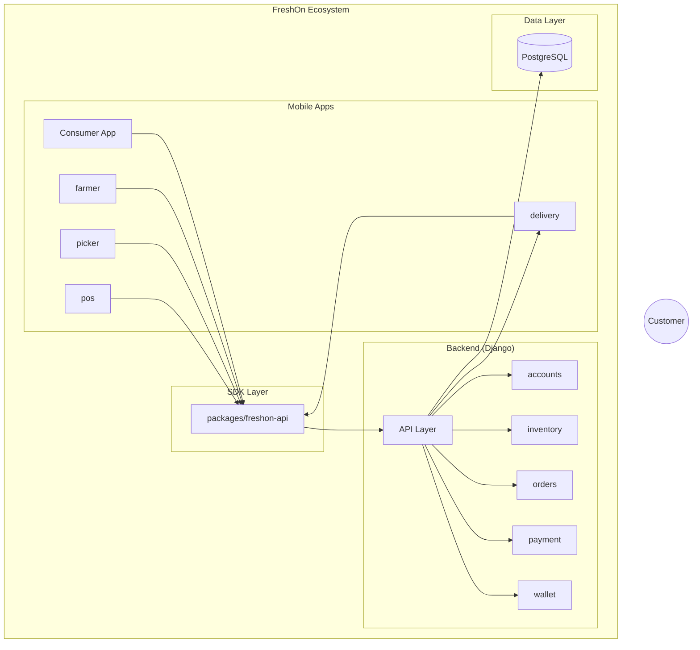

# System Architecture 🏗️

Freshon OS is designed as a modular microservices architecture to ensure scalability, security, and developer independence.

## 1. High-Level Diagram

## 2. Service Components

### **Nginx Reverse Proxy**
- **Purpose**: Acts as the single entry point (Gateway) for the system.
- **Routing**: 
    - `/api/` -> Backend (Django)
    - `/admin/` -> Backend (Django)
    - `/static/` & `/media/` -> Local Storage
    - `/` -> Frontend (React)

### **Django Backend**
- **Framework**: Django 5.0 + DRF.
- **Security**: Implements the **"Inter2" Pattern** using `HttpOnly` cookies for JWT storage. This prevents XSS attacks from stealing user tokens.
- **Micro-apps**:
    - `accounts`: User profiles, Farmer verification, Roles, Customer preferences & settings.
    - `inventory`: Product catalog, Farmer batches, Stock tracking.
    - `orders`: Atomic checkout transactions, Tracking IDs.
    - `delivery`: Delivery slots, addresses, service area validation.
    - `payment`: Razorpay integration, payment transaction tracking.
    - `wallet`: Digital wallet, PRIDE Partnership, referral system.
- **Services**:
    - Location Validation Service: Haversine-based service area validation for delivery zones.

### **Frontend (Tauri/React)**
- **State Management**: React Query for server state with smart caching
- **Routing**: React Router with Framer Motion page transitions
- **UI Components**: Custom skeleton loaders for loading states
- **Public Routes**: Home page ("/") accessible without authentication

### **Database (PostgreSQL)**
- Relational schema ensures data integrity for financial transactions (Orders) and inventory stock levels.

## 3. Data Flow (Checkout Example)

1. **User Action**: Customer clicks "Place Order" in the Mobile App.
2. **API Call**: Mobile App sends a `POST /api/orders/orders/` request via Nginx.
3. **Validation**: The Backend checks if the user is authenticated (via Cookie).
4. **Transaction**:
    - Backend opens a `transaction.atomic()` block.
    - Queries the `InventoryBatch` to verify real-time stock.
    - Deducts stock level.
    - Creates an `Order` with a unique `FRSH-XXXX` tracking ID.
    - Snapshots product prices to prevent future inconsistencies.
5. **Response**: Backend returns the `201 Created` status with the Tracking ID.
6. **UI Update**: Mobile App clears the cart and navigates to the **Track Order** view.
