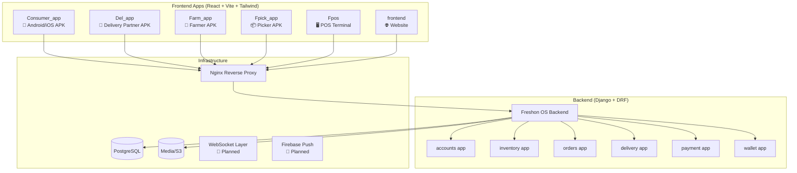
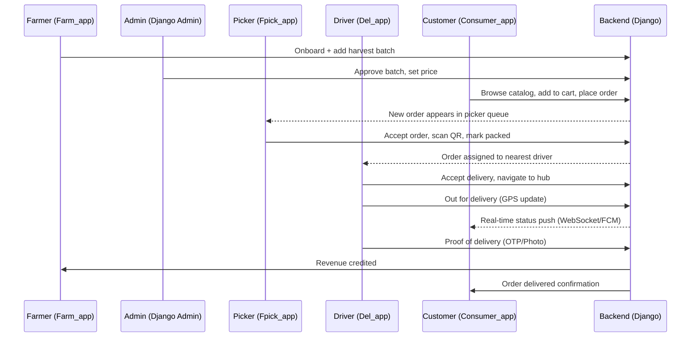
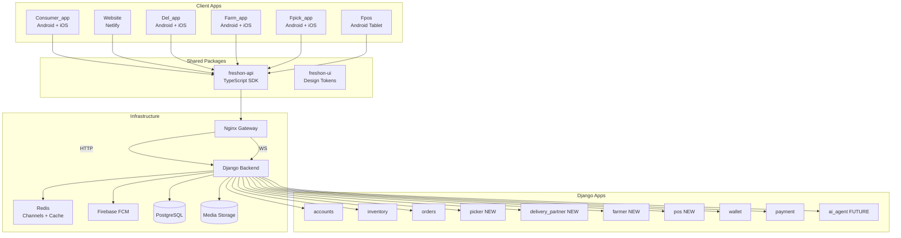

# FreshOn Ecosystem — Full Analysis & Centralized Build Plan 🌿

## 1. Current State of Each App

### Architecture At-a-Glance



---

### App-by-App Analysis

| App | Tech Stack | Current State | Missing Backend APIs | APK Ready? |
|-----|-----------|---------------|---------------------|------------|
| **Consumer_app** | React + Tauri + Framer Motion | ✅ Most complete — shop, cart, checkout, track, pride, profile, wallet | WebSocket tracking, PRIDE application flow, hero tabs | ✅ Android (keystore exists) |
| **Del_app** | React + Vite (was Supabase, now local auth) | ✅ UI complete — dashboard, mission, route, proof of delivery | No backend connection; uses local auth only | ⚠️ UI only |
| **Farm_app** | React + Vite | ✅ UI complete — full onboarding flow + dashboard | No backend connection; all flows are local state | ⚠️ UI only |
| **Fpick_app** | React + Vite | ✅ UI complete — geo-gate, pin login, picking, QA, complete | Uses `mockData` only; no real backend | ⚠️ UI only |
| **Fpos** | React + Vite + Zustand | ✅ UI complete — login, shift, product grid, billing, payment, receipt, wastage | No backend; all product data and billing is local | ⚠️ UI only |
| **frontend** | React + Vite + Netlify | ✅ Most complete (mirrors Consumer_app) — shop, PRIDE page, pride landing | Same backend as Consumer_app | ✅ Deployed on Netlify |

> **Critical Gap**: Del_app, Farm_app, Fpick_app, and Fpos all have **complete, polished UIs with zero backend connectivity**. They operate entirely off local state and mock data.

---

## 2. What the Backend Currently Supports

```
accounts: auth (JWT cookie), user profile, farmer profile, preferences, settings
inventory: categories (lazy-loaded), batches, farmer profiles
orders:    place order, track order
delivery:  slots, addresses, validate-location
payment:   razorpay init + verify
wallet:    balance, detail, history, top-up, verify top-up, topup history
wallet:    PRIDE partnership, refund request, referrals, referral code
```

### What's MISSING from the Backend (Required for Full System)

| Feature | Required By | Priority |
|---------|------------|----------|
| Picker task queue API | Fpick_app | 🔴 HIGH |
| Picker geo-fence auth endpoint | Fpick_app | 🔴 HIGH |
| Picker picks order / updates status | Fpick_app | 🔴 HIGH |
| Delivery partner auth + profile | Del_app | 🔴 HIGH |
| Delivery assignment API | Del_app | 🔴 HIGH |
| Delivery status updates (in-transit, delivered) | Del_app | 🔴 HIGH |
| Proof of delivery upload (photo/OTP) | Del_app | 🔴 HIGH |
| Farmer registration + OTP auth | Farm_app | 🔴 HIGH |
| Farmer profile CRUD | Farm_app | 🔴 HIGH |
| Farm media upload (video/photo) | Farm_app | 🔴 HIGH |
| Farmer product + batch management | Farm_app | 🔴 HIGH |
| Farmer dashboard metrics (sales, ratings, revenue) | Farm_app | 🟡 MEDIUM |
| Farmer payout status | Farm_app | 🟡 MEDIUM |
| POS product catalog sync | Fpos | 🔴 HIGH |
| POS order creation (walk-in) | Fpos | 🔴 HIGH |
| POS shift management | Fpos | 🟡 MEDIUM |
| POS wastage logging | Fpos | 🟡 MEDIUM |
| WebSocket: order status push | All apps | 🔴 HIGH |
| Firebase FCM push notifications | All apps | 🟡 MEDIUM |
| Supply-demand AI agent | Admin | 🟢 LOW |
| PRIDE application flow (document upload) | Consumer_app | 🟡 MEDIUM |
| Hero tabs content API | frontend / Consumer_app | 🟢 LOW |
| Search history + personalization | Consumer_app | 🟢 LOW |

---

## 3. Data Flow & Role Map



---

## 4. The Centralized Build Plan

### Phase 1 — Shared Infrastructure (Week 1–2)
> Build the foundation everything else depends on.

#### 1.1 Shared API Client Library (`packages/freshon-api`)
Create a **shared TypeScript library** used across all apps:
```
c:\dev\Freshon.in\packages\freshon-api\
├── client.ts          # Axios instance with cookie auth + CSRF
├── auth.ts            # login, logout, me, refresh
├── inventory.ts       # categories, batches, farmers
├── orders.ts          # place order, track order
├── delivery.ts        # slots, addresses, validate
├── wallet.ts          # balance, topup, history
├── picker.ts          # 🆕 picker queue, accept, scan
├── delivery-partner.ts# 🆕 assignments, status updates, proof
├── farmer.ts          # 🆕 farm profile, batches, metrics
├── pos.ts             # 🆕 POS orders, shifts, wastage
└── ws.ts              # 🆕 WebSocket manager (singleton)
```
**Config**: Each app sets `VITE_API_BASE_URL` in `.env` pointing to the central backend.

#### 1.2 Shared Design Tokens (`packages/freshon-ui`)
```
c:\dev\Freshon.in\packages\freshon-ui\
├── tailwind.preset.ts  # Golden Harvest shared design tokens
├── components/         # Shared shadcn/ui overrides
└── animations/         # Framer Motion variants
```

#### 1.3 Backend: Role System Extension
Extend the `User.role` enum:
```python
role = Enum("ADMIN", "FARMER", "CUSTOMER", "DELIVERY", "PICKER", "POS_OPERATOR")
```
Each login endpoint validates role and returns a role-scoped JWT cookie.

---

### Phase 2 — Backend API Extensions (Week 2–4)

#### 2.1 Picker App API (`apps/picker/`)
```python
GET  /api/picker/queue/              # Orders ready to pick, sorted by deadline
POST /api/picker/queue/{order_id}/accept/    # Accept order
POST /api/picker/queue/{order_id}/scan/      # QR scan verification per item
POST /api/picker/queue/{order_id}/pack/      # Mark all items packed
POST /api/picker/queue/{order_id}/handover/  # Hand to delivery
GET  /api/picker/geo-verify/         # Verify picker is at hub (lat/lng)
```

#### 2.2 Delivery Partner API (`apps/delivery_partner/`)
```python
GET  /api/delivery-partner/assignments/            # Active deliveries
POST /api/delivery-partner/assignments/{id}/accept/
POST /api/delivery-partner/assignments/{id}/pickup/ # At hub, picking up
POST /api/delivery-partner/assignments/{id}/transit/ # Out for delivery (GPS)
POST /api/delivery-partner/assignments/{id}/deliver/ # Proof of delivery
POST /api/delivery-partner/proof/                  # Photo/OTP upload
PATCH /api/delivery-partner/status/               # online/offline toggle
GET  /api/delivery-partner/earnings/              # Today's earnings
```

#### 2.3 Farmer API (`apps/farmer/`)
```python
POST /api/farmer/register/           # OTP-based farmer registration
GET  /api/farmer/profile/
PATCH /api/farmer/profile/
POST /api/farmer/media/              # Upload farm/product video
GET  /api/farmer/dashboard/          # Aggregated sales, ratings, revenue
GET  /api/farmer/batches/            # Farmer's own inventory batches
POST /api/farmer/batches/            # Add new harvest batch
PATCH /api/farmer/batches/{id}/      # Update stock
GET  /api/farmer/payouts/            # Payment history
```

#### 2.4 POS API (`apps/pos/`)
```python
POST /api/pos/login/                 # PIN-based POS login
POST /api/pos/shift/open/
POST /api/pos/shift/close/
GET  /api/pos/products/              # POS product catalog (from inventory)
POST /api/pos/orders/                # Walk-in order (cash/UPI)
POST /api/pos/wastage/               # Log wastage entry
GET  /api/pos/shift/summary/         # Current shift report
```

#### 2.5 WebSocket Layer (Django Channels)
```python
# channels routing
ws/notifications/              # Customer: their order updates
ws/picker/queue/               # Picker: new orders broadcast
ws/delivery/assignments/       # Driver: new assignment push
ws/admin/dashboard/            # Admin: live operations view
```

---

### Phase 3 — App-by-App Integration (Week 4–8)

#### 3.1 Fpick_app Integration (Priority #1)
**Current**: Uses `mockData` entirely.
**Target**:
- Replace `mockOrders` with `GET /api/picker/queue/`
- Replace geo hardcoding with real GPS + `/api/picker/geo-verify/`
- Replace PIN login with `/api/auth/login/` scoped to `PICKER` role
- Wire QR scan to `/api/picker/queue/{id}/scan/`
- Wire "All Packed" to `/api/picker/queue/{id}/pack/`
- Subscribe to `ws/picker/queue/` for live new orders

#### 3.2 Del_app Integration (Priority #2)
**Current**: Uses local auth (`useAuth` backed by localStorage).
**Target**:
- Replace local auth with backend `/api/auth/login/` scoped to `DELIVERY` role
- Wire `StatusToggle` (online/offline) to `PATCH /api/delivery-partner/status/`
- Wire `MissionCard` accept to `POST /api/delivery-partner/assignments/{id}/accept/`
- Wire stop completion to delivery status endpoints
- Wire `ProofDrawer` to `POST /api/delivery-partner/proof/`
- Wire `EarningsHeader` to `GET /api/delivery-partner/earnings/`
- Subscribe to `ws/delivery/assignments/` for live mission assignment

#### 3.3 Farm_app Integration (Priority #3)
**Current**: All state is local, no persistence.
**Target**:
- Replace OTP flow with real `POST /api/farmer/register/` + OTP verify
- Wire `FarmProfileStep` → `PATCH /api/farmer/profile/`
- Wire `VerificationStep` media upload → `POST /api/farmer/media/`
- Wire `Dashboard` metrics → `GET /api/farmer/dashboard/`
- Wire product list → `GET /api/farmer/batches/`
- Wire "Update Harvest" → `PATCH /api/farmer/batches/{id}/`

#### 3.4 Fpos Integration (Priority #4)
**Current**: Zustand store, fully local, hardcoded product list.
**Target**:
- Replace `data.ts` product list with `GET /api/pos/products/`
- Replace local login with `/api/pos/login/`
- Wire shift open/close to backend endpoints
- Wire billing/checkout to `POST /api/pos/orders/`
- Wire wastage panel to `POST /api/pos/wastage/`
- Wire `ShiftCloseScreen` summary to `GET /api/pos/shift/summary/`

#### 3.5 Consumer_app & frontend Completion
**Missing features to build**:
- PRIDE application flow (document upload portal)
- Hero 5-tab navigation (Organic Hub, Farm to Table, Pride, Flash Deals, Bulk Orders)
- Cart-to-cart order modification (before picker accepts)
- Real-time order tracking via WebSocket
- FCM push notifications

---

### Phase 4 — Real-time & Notifications (Week 8–10)

#### 4.1 Django Channels Setup
```bash
pip install channels channels-redis daphne
```
```python
# freshon_os/asgi.py
CHANNEL_LAYERS = {
    "default": {
        "BACKEND": "channels_redis.core.RedisChannelLayer",
        "CONFIG": { "hosts": [("redis", 6379)] }
    }
}
```

#### 4.2 WebSocket Client (shared `ws.ts`)
```typescript
// packages/freshon-api/ws.ts
class FreshOnWS {
  connect(channel: 'orders' | 'picker' | 'delivery' | 'admin'): WebSocket
  onMessage(handler: (event: OrderEvent | PickerEvent | DeliveryEvent) => void): void
  disconnect(): void
}
```

#### 4.3 Firebase Cloud Messaging
- Add FCM to backend: send push when order status changes
- Add FCM SDK to Consumer_app (Tauri Android/iOS)
- Push events: `ORDER_CONFIRMED`, `PICKER_ACCEPTED`, `OUT_FOR_DELIVERY`, `DELIVERED`

---

### Phase 5 — Mobile Packaging (Week 10–12)

#### APK / IPA Build Strategy
All apps use Vite + can be wrapped with **Capacitor** (cross-platform) or kept as **Tauri** (desktop/Android):

| App | Target | Method | Notes |
|-----|--------|--------|-------|
| Consumer_app | Android APK + iOS IPA | Tauri (already configured) | Keystore exists |
| Del_app | Android APK + iOS IPA | Capacitor + Vite | Simpler than Tauri for PWA-style apps |
| Farm_app | Android APK + iOS IPA | Capacitor + Vite | Same |
| Fpick_app | Android APK + iOS IPA | Capacitor + Vite | Geo-fencing needs native GPS |
| Fpos | Android Tablet APK | Capacitor (tablet layout) | 1024×768 tablet target |
| frontend | Web only | Netlify (current) | No APK needed |

**Capacitor setup for each app**:
```bash
npm install @capacitor/core @capacitor/android @capacitor/ios
npx cap init "AppName" "in.freshon.appname"
npx cap add android
npx cap add ios
npx cap sync
```

#### Required Capacitor Plugins
```
@capacitor/geolocation       # Fpick geo-gate, Del_app GPS
@capacitor/camera            # Proof of delivery photo
@capacitor/push-notifications # FCM push
@capacitor/barcode-scanner   # Picker QR scan
@capacitor/filesystem        # File uploads (farmer media)
```

---

### Phase 6 — AI & Intelligence Layer (Month 3+)

#### 6.1 Supply-Demand Forecasting Agent
```python
# apps/ai_agent/
class SupplyDemandAgent:
    def predict_demand(self, sku_id, days=7) -> int
    def recommend_harvest(self, farmer_id) -> dict
    def generate_reorder_request(self, sku_id) -> PurchaseOrder
```
**Data inputs**: historical order data, category seasonality, weather API

#### 6.2 Smart Auto-Reorder System
- Monitor `InventoryBatch.stock_level` vs `min_threshold`
- Auto-create PO draft when threshold hit
- Alert admin + assign task to warehouse staff

---

## 5. Centralized System Architecture (Target State)



---

## 6. Build Priority & Sprint Plan

| Sprint | Week | Deliverables |
|--------|------|-------------|
| Sprint 1 | Wk 1-2 | Shared `freshon-api` SDK, role extension, Picker backend API |
| Sprint 2 | Wk 2-3 | Delivery Partner backend API, Fpick_app → backend wiring |
| Sprint 3 | Wk 3-4 | Farmer backend API, Del_app → backend wiring |
| Sprint 4 | Wk 4-5 | POS backend API, Farm_app → backend wiring |
| Sprint 5 | Wk 5-6 | Fpos → backend wiring, Django Channels (WebSocket) |
| Sprint 6 | Wk 6-7 | Consumer_app WebSocket, FCM push notifications |
| Sprint 7 | Wk 7-8 | PRIDE application flow, Hero tabs, order modification |
| Sprint 8 | Wk 8-9 | Capacitor packaging for all 4 operational apps |
| Sprint 9 | Wk 9-10 | QA, E2E testing, APK signing & distribution |
| Sprint 10 | Wk 10+ | AI agent, auto-reorder, forecasting |

---

## 7. Key Decisions & Recommendations

> [!IMPORTANT]
> **Immediately**: Farm_app, Fpick_app, Del_app, and Fpos need their backends built before any further UI work. The UIs are production-ready — the data layer is the bottleneck.

> [!TIP]
> **Use Capacitor over Tauri for the 4 operational apps** (Del, Farm, Pick, POS). Capacitor has better plugin ecosystem for geo, camera, barcode, and push notifications. Reserve Tauri for Consumer_app where the existing config already works.

> [!WARNING]
> **Del_app still has Supabase remnants** (`supabase/` directory). These must be fully removed before backend wiring begins. The local auth hook (`useAuth`) needs to be replaced with the centralized cookie-based auth.

> [!NOTE]
> **WebSocket is the linchpin**. Without it, the Picker and Delivery apps can't receive real-time assignments. This should be built in Sprint 5 alongside the first production app integrations.

> [!TIP]
> **Shared TypeScript SDK** (`packages/freshon-api`) is the most high-leverage investment. Build this once, import it in all 6 apps. It centralizes base URL config, cookie handling, and error handling — eliminating ~30% of boilerplate from each app.
